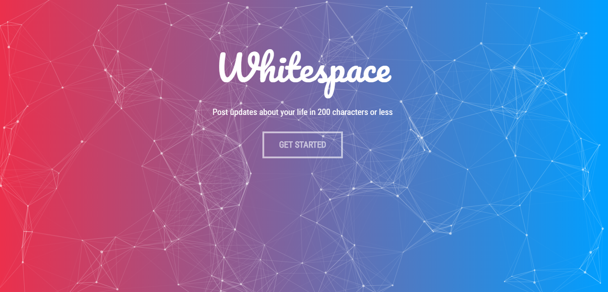
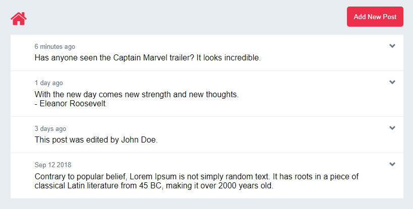
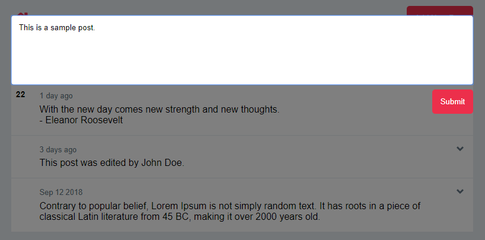
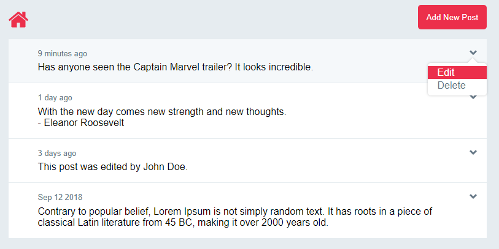

## [Whitespace](http://whitespacebb.herokuapp.com/)
Whitespace is a three-tier bulletin board web application that enables users to write 200 character posts for other users to see. It is built with the MERN stack and WebSockets to ensure user concurrency and a responsive interface. 

__Landing Page:__  
  

__Results Page:__  
  
Here the posts from the users are laid out with timestamps  

__Creating A Post:__  
  
From the user's perspective, creating a post is as simple as formulating an idea

__Post Options:__  
  
If someone does not like a post, they are free to edit or delete it

## Running Locally
__1. Server Setup__  
To run the project locally, you must first install the npm dependencies. Assuming you have [Node.js](https://nodejs.org/en/download/) installed, navigate to project directory and run `npm install`. This will install the dependencies required for the server. 

__2. Client Setup__  
To install the dependencies for the client, inside of the client folder of the project run `npm install`.

__3. Environment Variables__  
All of the dependencies should be installed now, but the server won't be able to find all of the information it needs to run. Create a file named `.env` and inside add the following three lines, filling in necessary information:
```
DB_URL=[link to remote or local mongoDB]
NODE_ENV=dev
PORT=5000
```

Example:
```
DB_URL=mongodb://localhost/sample_db
NODE_ENV=dev
PORT=5000
```

__4. Running Client and Server__  
To start the server, run `node server.js` in the main project directory. Do __not__ close the terminal! The server will need to run throughout the testing duration. In another terminal instance, run `npm start` inside of the client folder. Once the client deployment script has finished, the application should automatically launch in your default browser, but if it does not, you can open it manually in the browser at [http://localhost:3000](http://localhost:3000).

## Technical Components
* __React:__
  * This project involved a lot of DOM manipulation and element creation. Since React maintains a virtual DOM and only re-renders the components that changed, when a user updates a single post, only that post will have to be rendered again. This dramatically increases the speed and responsiveness of the application.
  * React components made the project code and HTML much more readable. To create a new message, a message component can be given the properties it needs to render, instead of manually adding elements to the DOM with long strings of HTML and the createElement function.
* __WebSockets:__
  * Used Socket.IO to enable real-time client communication. When one client adds, updates, or deletes a post, the UI of the other clients is also updated. This prevents users from having to refresh the page when they want to fetch updates from the server. This can be tested by opening several tabs of the site and performing one of the CRUD operations. All of the open clients should instantly be updated with any changes.
* __Timestamps:__
  * Developed algorithm for determining time elapsed between when the page was loaded and when a post was submitted to the database. The algorithm took the elapsed time then determined how to display the timestamp (now, number of minutes, hours, days elapsed, or the actual date of post). The various timestamps can be seen in the second screenshot.
* __Particle.js:__
  * Created custom configuration for Particle.js library to render the background of the landing page. This involved defining number of particles, size, density and interactivity. Originally, the background was interactive, making particles follow the user's cursor, but this was covered by a div in the production application because it was too GPU intensive for some users.

## Design Components
* __Landing Page:__
   * Styled vibrant and animated homepage with Particle.js to give the site a modern and professional feeling 
   * Used warm colors and gradient to make the site feel welcoming and to provide a short description about what the site is for
* __Sass/Scss:__
    * Styled application with SCSS so that variables could be used within style files. This enabled similar elements to receive similar coloring or sizing, which made changing the color theme or adapting the application for mobile use a matter of changing a few variables. 
* __Media Queries:__
    * Used media queries to resize elements based on screen size. This prevents UI elements from stacking on top of each other or going off of the page and makes the site mobile friendly.
* __404 Page:__
    * Instead of allowing the user to wait for a request to timeout if they request a non-existent route, a styled 404 page is served when the user visits a route that the application has not explicitly defined.
* __Informative Error Messages:__
    * When a user tries to perform a prohibited action, such as submitting a post with no text, an error message is displayed in the text box to tell the user why the post was not submitted.
* __Semi-Transparent Overlay:__
    * The form for creating or updating a post is displayed over a semi-transparent background. This is to let the user know that they have not navigated away from the page they were on. There is also a click listener on the overlay so that if the user wants to see all of the posts again, they can click away from the form and it will hide.
* __Abstracted UI Elements:__
    * To keep the main UI clean and sleek, the update and delete buttons are, by default, hidden in a pull-down menu. When the menu button is clicked, the options will be displayed and when it is clicked again, the options will hide.
